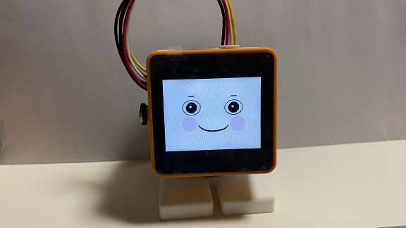
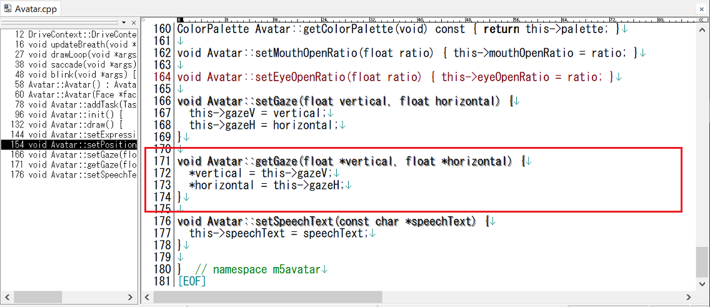
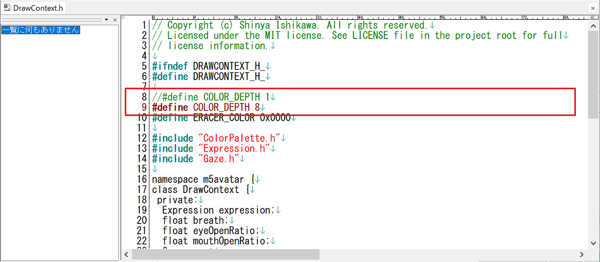

# M5Core2_SG90_StackChan_VoiceText_Ataru
M5Core2_SG90_StackChan_VoiceText_Ataru

@mongonta555 さんが[ｽﾀｯｸﾁｬﾝ M5GoBottom版組み立てキット](https://raspberrypi.mongonta.com/about-products-stackchan-m5gobottom-version/ "Title")の頒布を始められたので、それに対応したｽﾀｯｸﾁｬﾝファームを作ってみました。 

 

---
### M5GoBottom版ｽﾀｯｸﾁｬﾝ本体を作るのに必要な物、及び作り方 ###
こちらを参照してください。 
* [ｽﾀｯｸﾁｬﾝ M5GoBottom版組み立てキット](https://raspberrypi.mongonta.com/about-products-stackchan-m5gobottom-version/ "Title") 

### このプログラムをビルドするのに必要な物 ###
* Arduino IDE (バージョン 1.8.15で動作確認をしました。~~1.8.16だとエラーになるという報告を頂きました。~~) 
* [M5Stack-Avatar](https://github.com/meganetaaan/m5stack-avatar/ "Title")ライブラリ(バージョン 0.7.3で動作確認をしました。) 
* [ServoEasing](https://github.com/ArminJo/ServoEasing/ "Title")ライブラリ(バージョン 2.4.0で動作確認をしました。) 
* [ESP32Servo](https://github.com/madhephaestus/ESP32Servo/ "Title")ライブラリ(バージョン 0.9.0で動作確認をしました。) 
* [ESP8266Audio](https://github.com/earlephilhower/ESP8266Audio/ "Title")ライブラリ(バージョン 1.9.3で動作確認をしました。)  
(arduino-esp32 v2.0.1だとエラーになるという報告を頂きました。) 

* 以下のバージョンの組み合わせで動いたという報告を頂きました。 
Arduino IDE 1.8.19 
Arduino-esp32 1.0.6 (ボードマネージャ) 
M5Stack-Avatar 0.7.4 
ServoEasing 2.4.0 
ESP32Servo 0.9.0 
ESP8266Audio 1.9.3 
 

### M5Stack-Avatarライブラリを変更する ###
* "Avatar.cpp"の下図赤枠部分を変更します。(バージョン 0.7.4以降では変更不要になりました。)
   
* "Avatar.cpp""Avatar.h"の下図赤枠部分を追加します。
   
   
* "DrawContext.h"の下図赤枠部分を変更します。
   

---

---

M5Stack Core2の場合、M5Stack-AvatarとHOYA社が提供する[VoiceText Web APIサービス](https://cloud.voicetext.jp/webapi "Title")を使った音声合成(TTS)を使うことができます。

VoiceText TTSは、kghrlaboさんのesp32_text_to_speechを参考にさせていただきました。 
オリジナルはこちら。 
esp32_text_to_speech <https://github.com/kghrlabo/esp32_text_to_speech> 

### VoiceTextの有効化 ###
* M5Core2_SG90_StackChan_VoiceText_Ataru.inoの22行目のコメントを外して”USE_VOICE_TEXT”を有効化してください。

### WiFiの設定 ###
* M5Core2_SG90_StackChan_VoiceText_Ataru.inoの31行目付近、SSIDとPASSWORDを設定してください。

### VoiceText Wev API api キーの設定 ###
* AudioFileSourceVoiceTextStream.cppの30行目付近、YOUR_TSS_API_KEYを設定してください。 
APIキーは、[ここ](https://cloud.voicetext.jp/webapi/ "Title")の「無料利用登録」から申請すれば、メールで送られて来ます。 

---

### 使い方 ###
* VoiceTextを有効にしていない場合：M5Stack Core2のボタンA,B,Cを押すと、それぞれ異なった顔を表示します。　 
* VoiceTextを有効にしている場合：M5Stack Core2のボタンA,B,Cを押すと、それぞれ異なった顔と声でしゃべります。　 
音声データをダウンロード中は顔にハートマークが表示されます。 
TTSのパラメータの詳細はこちらを参照してください。 
[VoiceText Web API [API マニュアル](https://cloud.voicetext.jp/webapi/docs/api/ "Title")]
  

